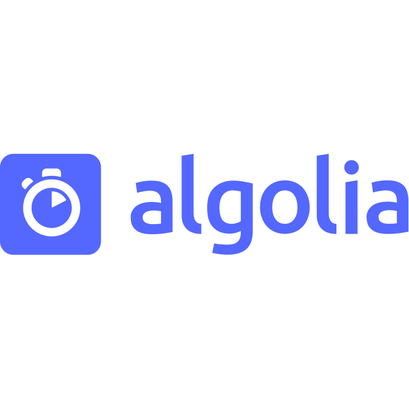

# **The Hourglass**

## **Resumo**

Este projeto é um Gerenciador de Tarefas, uma aplicação web CRUD que combina várias tecnologias modernas para criar uma experiência de busca eficiente e intuitiva. As principais tecnologias utilizadas são React, Express e Firebase, o Firebase é usado para armazenar os dados gerados pelos usuário, neste projeto fiz uso do Firebase Functions e do Firebase Emulator, o Express.js é o nosso servidor que fornece rotas para recuperar e lançar dados, o Typescript é uma extensão do Javascript que fornece uma maior estabilidade no desenvolvimento de código ao associar tipos de dados às variáveis, o Algolia é uma Search Engine baseada em IA que faz busca full-text em todos os dados registrados, comentarei abaixo com mais detalhes as tecnologias e explicarei como elas interagem para formar a aplicação final.

## **Tecnologias Utilizadas**

### 
### **React**

React é uma biblioteca JavaScript para construção de interfaces de usuário. Ela facilita a criação de componentes reutilizáveis e a gestão do estado da aplicação.

**Como é utilizado no projeto:**
- Criação da interface de usuário.
- Gestão do estado e renderização dos resultados de busca.
- Interação com o backend via Axios.

### 
### **Node.js**

Node.js é um runtime JavaScript que permite a execução de código JavaScript no lado do servidor. É conhecido por sua eficiência e capacidade de lidar com muitas conexões simultâneas.

**Como é utilizado no projeto:**
- Execução do servidor backend.
- Manipulação de solicitações HTTP e WebSocket.

### 
### **Express.js**
Express.js é um framework web para Node.js que simplifica o processo de criação de aplicações web e APIs.

**Como é utilizado no projeto:**
- Definição de rotas para a API.
- Gestão de solicitações e respostas HTTP.

### 
Firebase é uma plataforma de desenvolvimento de aplicativos móveis e web que oferece uma variedade de ferramentas, incluindo banco de dados em tempo real, autenticação e hospedagem.

**Como é utilizado no projeto:**
- Autenticação de usuários.
- Armazenamento de dados do usuário e logs de busca.
- Hospedagem do frontend.

### 
### **Typescript**
Typescript é um superset de JavaScript que adiciona tipagem estática ao código, ajudando a prevenir erros e melhorar a manutenção do código.

**Como é utilizado no projeto:**
- Escrita de código tanto no frontend quanto no backend.
- Definição de tipos para garantir a consistência dos dados.

### 
### **Algolia**
Algolia é um serviço de busca em tempo real que oferece uma API poderosa para implementação de busca rápida e relevante.

**Como é utilizado no projeto:**
- Indexação dos dados para busca.
- Consulta de dados de forma eficiente e rápida.

## **Interação entre as Tecnologias**

### **Fluxo de Dados**

1. **Interface de Usuário (React)**: O usuário interage com a interface de usuário, que é construída com React. Quando uma busca é iniciada, uma requisição é enviada para o backend.

2. **Backend (Node.js + Express.js)**: O backend, implementado com Node.js e Express.js, recebe a requisição de busca. Ele então processa a requisição e interage com o Firebase para buscar os resultados.

3. **Busca (Algolia)**: Algolia processa a requisição de busca e retorna os resultados relevantes para o front-end.

4. **Autenticação e Dados do Usuário (Firebase)**: Firebase é usado para autenticação de usuários. Os dados do usuário e logs de busca são armazenados no Firebase, facilitando a personalização e análise de uso.

5. **Resposta e Renderização (React)**: O backend envia os resultados da busca de volta para o frontend, onde React os renderiza na interface do usuário.

### **Benefícios da Integração**

- **Desempenho**: A utilização de Algolia permite buscas extremamente rápidas e relevantes, melhorando a experiência do usuário.
- **Escalabilidade**: Node.js e Firebase permitem que a aplicação escale facilmente para atender a muitos usuários simultaneamente.
- **Manutenção e Evolução**: O uso de Typescript garante um código mais robusto e fácil de manter e evoluir.
- **Experiência do Usuário**: React oferece uma interface de usuário interativa e responsiva, tornando a aplicação agradável de usar.

## **Conclusão**

Este projeto buscar demonstrar como várias tecnologias modernas podem ser integradas para criar uma aplicação web robusta e eficiente, além de demonstrar de forma prática a integração das mesmas. Cada tecnologia traz seus próprios benefícios, e a combinação delas resulta em uma experiência de usuário otimizada e uma arquitetura de aplicação escalável e fácil de manter.
